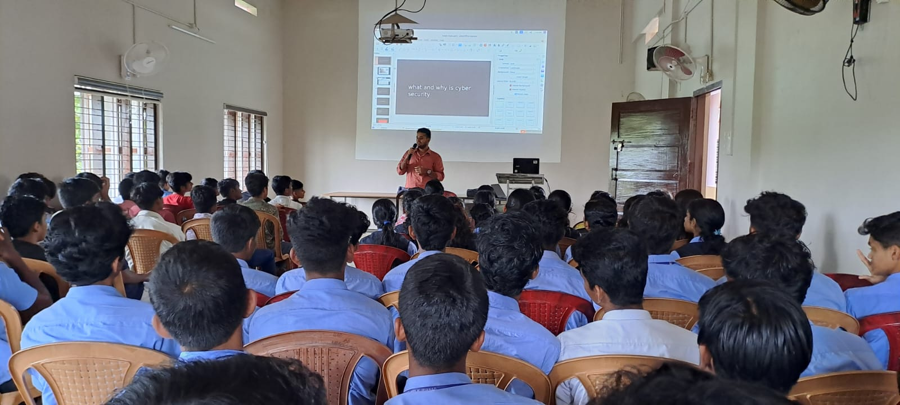
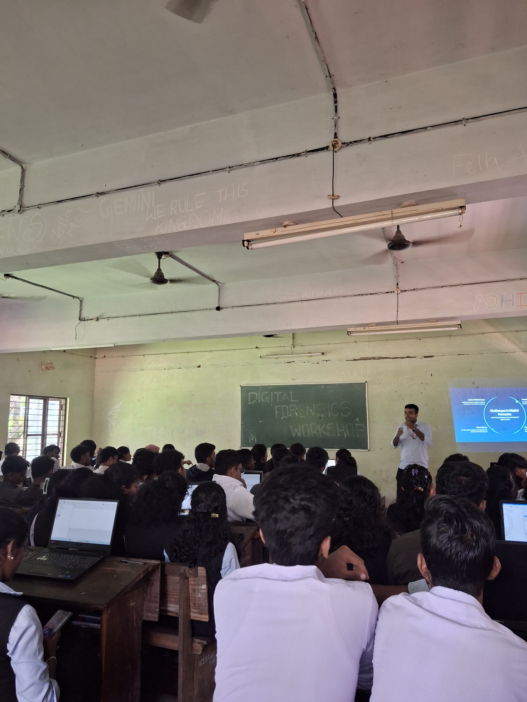

# Hello, I'm Santo

I am a Final Year Cyber security student from UCE thodupuzha and is interested in safeguarding the digital world.

## Objective

My journey in Cyber Security has led me to develop a passion for cybersecurity, and I am now eager to work in R&D as well as Blue teaming oppurtunites in this fied.

## Skills

| Skill                                         | Associated Project         |
|-----------------------------------------------|----------------------------|
| SIEM Implementation and Log Analysis          | <a href="https://github.com/Tw0side/Cyber-Intern-Phase-1">Detection Lab</a>|
| Network Traffic Monitoring and Attack Detection | <a href="https://github.com/Tw0side/Traffic-Nexus-V1-Frontend">Traffic Nexus</a>|
| NOAA LOG Visualization                         |  <a href="https://github.com/Tw0side/NOAALOGVISUALIZATION">NOAA</a>|
| PYTHON Scripts                                 |  <a href="https://github.com/Tw0side/scripting/tree/main">Scripting</a>|

## Tools

### Network

    
    
    
    
    

### Endpoint

    
    

### SIEM

    

## Certifications

## Projects
- <a href="https://github.com/Tw0side/Cyber-Intern-Phase-1">Detection Lab</a>
- <a href="https://github.com/Tw0side/Traffic-Nexus-V1-Frontend">Traffic Nexus</a>

## Speaking Sessions 

-Awareness Session at St Anns HSS

-Workshop on Digital Forensics

-ISRA COMMUNITY MEETUP session on The topic Quantum Resistant Framework for SCADA systems.

